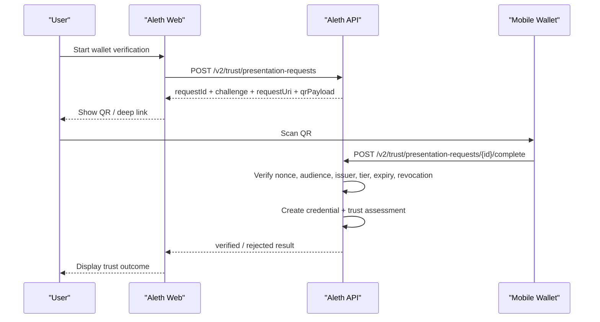
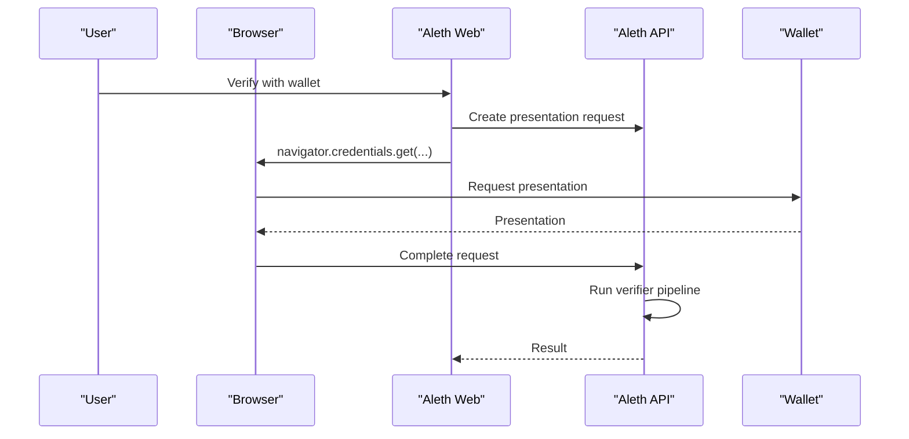

# Aleth Wallet Verification Architecture

## Purpose

Aleth needs a web-native path for verifying credentials that are stored in a
user's mobile digital wallet. The wallet remains the holder of the credential.
Aleth Web acts as the verifier UI. Aleth API acts as the verifier backend,
policy engine, and trust state writer.

This document defines the prototype architecture for wallet verification in a
way that fits the existing trust, issuer, and verifier model.

## Core Principle

```text
Wallet stores the credential.
Web requests a presentation.
API verifies proof + issuer policy.
Aleth writes a trust outcome, not a raw copy of the wallet.
```

## Goals

- let a user prove L2/L3 evidence from a wallet without uploading full identity
  data by hand
- keep issuer trust decisions in Aleth's trusted issuer registry
- share the same trust pipeline used by verifier-issued credentials
- support cross-device flows first, then same-device browser wallet flows later

## Non-Goals For This Prototype

- full OpenID4VP request-object signing
- full W3C VC / SD-JWT VC / mdoc cryptographic verification
- direct wallet SDK integration with a production mobile wallet
- self-service L4 governance elevation

This prototype fixes the Aleth API shape and trust flow first. Cryptographic
adapters can be swapped in later.

## Roles

- `Holder`: the end user with credentials in a mobile wallet
- `Wallet`: stores credentials and returns a signed presentation
- `Aleth Web`: starts verification and shows request / result state
- `Aleth API`: validates nonce, audience, issuer policy, expiry, revocation,
  and writes trust state
- `TrustedIssuer`: registry entry that defines which issuer can support which
  credential types and trust tiers
- `Verifier`: still used for manual review and issuer governance, but not
  required for a successful L3 wallet verification

## Supported Flows

### 1. Cross-Device Flow

The user opens Aleth on desktop, starts a wallet verification request, and
scans a QR payload with a phone wallet.



### 2. Same-Device Browser Flow

This will later use the browser's Digital Credentials API, but should still
terminate in the same Aleth verifier endpoint.



## Product Rules

- wallet verification is a user-consented bridge from private credential
  storage to Aleth trust state
- Aleth should store the minimum durable evidence needed for audit and trust
  continuity
- issuer trust is decided by Aleth's `TrustedIssuer` registry, not by the
  wallet itself
- successful wallet verification can automatically produce L2/L3 trust
  outcomes
- L4 remains a governed appointment path, not a self-upgrade wallet path

## Domain Model

### `WalletPresentationRequest`

Represents one verifier request created by Aleth.

Fields:

- `id`
- `subject_did`
- `verifier_did`
- `requested_tier`
- `credential_type`
- `purpose`
- `allowed_issuer_dids`
- `challenge`
- `request_uri`
- `qr_payload`
- `status`: `pending | completed | verified | rejected | expired`
- `created_at`
- `expires_at`
- `completed_at`

Notes:

- `subject_did` is the Aleth identity asking to be verified.
- `verifier_did` is the Aleth DID acting as the verifier backend identity.
- `allowed_issuer_dids` narrows the issuer set when required by policy.

### `WalletPresentationVerification`

Represents the result of one wallet submission against one request.

Fields:

- `id`
- `request_id`
- `subject_did`
- `issuer_did`
- `credential_type`
- `presentation_format`
- `claims_json`
- `proof`
- `audience`
- `nonce`
- `status`: `verified | rejected`
- `trusted_issuer_did`
- `notes`
- `issued_credential_id`
- `issued_assessment_id`
- `created_at`
- `verified_at`

Notes:

- this is the durable audit record of what Aleth actually checked
- the created credential and trust assessment remain part of the existing trust
  model

### `TrustedIssuer`

Already exists. Wallet verification uses it as policy input:

- issuer status must be `active`
- issuer must allow the submitted `credential_type`
- issuer must be authorized for the requested trust tier

### `Credential`

Already exists. Wallet verification creates:

- `issuance_source = external_issuer_verified`
- `issuer_did = trusted issuer DID`
- `external_issuer_did = trusted issuer DID`

### `TrustAssessment`

Already exists. Wallet verification creates:

- `source = credential`
- `tier = requested tier`
- `evidence_refs = [presentation_request_id, verification_result_id]`

## Verification Pipeline

Aleth verifies a wallet submission in this order:

1. request exists and is still valid
2. request belongs to the current subject or current verifier context
3. nonce matches the request challenge
4. audience matches the request URI
5. credential type matches the request
6. issuer exists in `TrustedIssuer`
7. issuer status is `active`
8. issuer is allowed by `allowed_issuer_dids` if the request constrained issuer
9. issuer is authorized for the requested credential type and trust tier
10. submission is not expired or revoked
11. submission contains a proof payload

If all checks pass, Aleth:

- writes `WalletPresentationVerification`
- creates `Credential`
- creates `TrustAssessment`
- upgrades `users.trust_tier` through the existing assessment pipeline
- writes a trust audit log

## API

### `POST /v2/trust/presentation-requests`

Create a new wallet verification request.

Request:

```json
{
  "requestedTier": 3,
  "credentialType": "organization_membership",
  "purpose": "Verify L3 board participation rights",
  "allowedIssuerDids": ["did:web:issuer.example"],
  "expiresInMinutes": 15
}
```

Response:

```json
{
  "id": "wpr_123",
  "subjectDid": "did:vflow:alice",
  "verifierDid": "did:web:aleth.example",
  "requestedTier": 3,
  "credentialType": "organization_membership",
  "purpose": "Verify L3 board participation rights",
  "allowedIssuerDids": ["did:web:issuer.example"],
  "challenge": "9f2a...",
  "requestUri": "openid4vp://aleth/request/wpr_123",
  "qrPayload": "{\"requestId\":\"wpr_123\",\"nonce\":\"9f2a...\"}",
  "status": "pending",
  "createdAt": "2026-04-24T10:00:00Z",
  "expiresAt": "2026-04-24T10:15:00Z"
}
```

### `GET /v2/trust/presentation-requests`

List wallet verification requests.

- regular users see their own requests
- active L4 verifiers can inspect all requests

### `GET /v2/trust/presentation-requests/{requestId}`

Fetch one request and its latest verification result.

### `POST /v2/trust/presentation-requests/{requestId}/complete`

Submit a wallet presentation for verification.

Request:

```json
{
  "issuerDid": "did:web:issuer.example",
  "credentialType": "organization_membership",
  "presentationFormat": "mock_wallet",
  "claimsJson": "{\"memberId\":\"org-42\",\"role\":\"researcher\"}",
  "proof": "signed-presentation-placeholder",
  "audience": "openid4vp://aleth/request/wpr_123",
  "nonce": "9f2a...",
  "expiresAt": "2026-06-01T00:00:00Z"
}
```

Response:

```json
{
  "id": "wpv_123",
  "requestId": "wpr_123",
  "subjectDid": "did:vflow:alice",
  "issuerDid": "did:web:issuer.example",
  "credentialType": "organization_membership",
  "presentationFormat": "mock_wallet",
  "claimsJson": "{\"memberId\":\"org-42\",\"role\":\"researcher\"}",
  "proof": "signed-presentation-placeholder",
  "audience": "openid4vp://aleth/request/wpr_123",
  "nonce": "9f2a...",
  "status": "verified",
  "trustedIssuerDid": "did:web:issuer.example",
  "issuedCredentialId": "cred_123",
  "issuedAssessmentId": "tas_123",
  "createdAt": "2026-04-24T10:02:00Z",
  "verifiedAt": "2026-04-24T10:02:00Z"
}
```

## Relationship To Existing Trust Flow

- manual L2/L3 review still uses `VerificationCase` and `VerifierDecision`
- wallet verification is a parallel self-service path for issuer-backed claims
- both paths converge on the same durable objects:
  - `Credential`
  - `TrustAssessment`
  - `TrustAuditLog`

## Security Notes

- the browser should not receive a blanket read of wallet contents
- wallet submissions must be bound to a single-use nonce
- the verifier backend must check audience to prevent replay in another relying
  party
- issuer trust policy must remain server-side
- Aleth should store derived trust state and audit artifacts, not the full
  credential bundle unless policy requires it

## Implementation Phases

### Phase A: Prototype Verifier Slice

- add request / complete / result APIs
- add durable request and verification models
- use mock-wallet presentation format
- validate nonce, audience, issuer policy, expiry, revocation
- create credential + trust assessment on success

### Phase B: Cross-Device Wallet UX

- generate real QR payloads / deep links
- polling or streaming request status in web UI
- mobile wallet handoff page

### Phase C: Standard Protocol Adapters

- OpenID4VP request objects
- SD-JWT VC verification
- mdoc verification
- DID document resolution and key rotation support

### Phase D: Same-Device Browser Wallet

- Digital Credentials API integration
- browser wallet mediation and account chooser
- shared verifier backend with the same request / completion semantics

### Phase E: Governance and Operations

- issuer-specific revocation checks
- richer trust policy engine
- board-specific issuer policy
- verifier review dashboard for rejected / suspicious presentations
