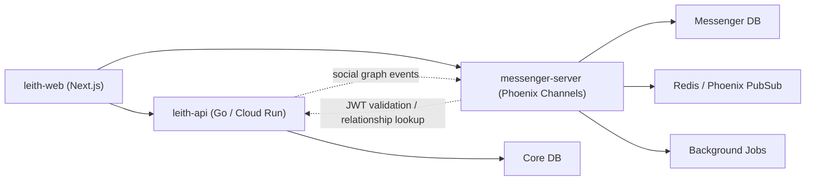

# Aleth E2EE Messenger Architecture

## Purpose

Aleth Messenger is an independent real-time collaboration service for trusted
people. It is not a generic social inbox bolted onto the forum. It extends
Aleth's identity and trust model into private communication while preserving a
strong cryptographic boundary:

- Core owns social truth.
- Messenger owns encrypted communication.
- Clients own plaintext and cryptographic state.

Messenger should support direct and group communication between certified
participants, while preventing the server from reading private message content.

## Product Positioning

Messenger is the fourth collaboration surface beside the existing three content
modes:

- `Murmur`: private or semi-private early expression
- `Idea`: authored structured thinking
- `Discussion`: public community-owned debate
- `Messenger`: trusted private collaboration

The product role of Messenger is to support:

- private coordination around an idea
- trusted direct messages between certified users
- moderator or verifier coordination rooms
- private discussion around a public debate thread
- user-approved transformation of chat context back into an idea or discussion

Messenger must not become an untrusted spam vector. Contact permissions,
relationship policy, and trust-tier capability checks remain part of the core
Aleth product.

## Key Decisions

### 1. Messenger is a separate service

Messenger should be deployed independently from the current Next.js frontend and
Go API. The service has different runtime needs:

- long-lived WebSocket connections
- presence and typing state
- high-frequency small writes
- encrypted mailbox delivery
- realtime fanout
- future group key rotation

The recommended implementation is a Phoenix service because Phoenix Channels
fit the connection/topic/fanout model naturally.

### 2. Core remains the authority for members and relationships

Messenger should not create a second source of truth for users, friends, trust
tiers, boards, blocks, or account status.

Core owns:

- identity
- passkey account state
- trust tier
- friend graph
- block and mute policy
- board membership
- account suspension
- messaging permission policy

Messenger owns:

- devices
- public prekey bundles
- conversations
- conversation membership snapshots
- encrypted message envelopes
- receipts
- presence
- typing state
- E2EE identity verification records

### 3. End-to-end encryption is required from the start

Messenger should be designed as E2EE-first. The server stores encrypted message
envelopes and public key material only. Plaintext should exist only on client
devices after decryption.

The planned cryptographic design is based on the Signal Protocol family:

- X3DH for asynchronous initial session setup
- Double Ratchet for per-message ratcheting
- Sesame-style session management for multi-device asynchronous messaging

The project should avoid hand-rolling cryptography from the specifications
without test vectors and mature library review.

### 4. WebSocket is the realtime transport

Messenger should use WebSocket for realtime delivery, receipts, typing, and
presence. WebSocket is not the source of truth. The database remains the
durable mailbox. Clients must reconnect and sync missed encrypted messages.

## Deployment Shape

Recommended production shape:



Suggested domains:

- `aleth.example.com` for web
- `aleth.example.com/api/*` for core API
- `messenger.aleth.example.com` for Phoenix Messenger

The messenger service can be hosted separately from GCP Cloud Run. Fly.io,
GKE, or a dedicated VM/MIG are better natural fits for Phoenix long-lived
connections than request-oriented serverless hosting.

Cloud Run can support WebSockets, but its timeout and best-effort session
affinity model make it less ideal as the long-term Messenger runtime.

## Service Boundary

### Core API responsibilities

Core API is the authority for social truth.

Required future endpoints:

```text
POST /v2/auth/messenger-token
GET  /v2/social/relationship/{peerDid}
GET  /v2/social/friends
GET  /v2/social/blocks
GET  /v2/boards/{boardId}/memberships/me
```

`POST /v2/auth/messenger-token` should issue a short-lived JWT for Messenger.

Suggested JWT claims:

```text
sub: user DID
aud: messenger
device_id: current device ID
trust_tier: current trust tier
account_status: active | suspended | disabled
exp: short expiration
```

### Messenger responsibilities

Messenger validates the token and enforces relationship policy by consulting
Core.

Messenger endpoints:

```text
POST   /v2/messenger/devices
GET    /v2/messenger/devices/me
DELETE /v2/messenger/devices/{deviceId}

POST   /v2/messenger/prekeys
GET    /v2/messenger/users/{did}/prekey-bundle

GET    /v2/messenger/conversations
POST   /v2/messenger/conversations
GET    /v2/messenger/conversations/{id}

GET    /v2/messenger/conversations/{id}/messages?after=
POST   /v2/messenger/conversations/{id}/messages

POST   /v2/messenger/messages/{id}/delivered
POST   /v2/messenger/messages/{id}/read

GET    /v2/messenger/ws
```

Messenger may cache relationship snapshots, but the cache is not authoritative.
Important actions such as creating a conversation or sending the first direct
message should verify policy with Core.

## Phoenix Channel Model

Phoenix Channel topics:

```text
user:{did}:devices
conversation:{conversation_id}
presence:{conversation_id}
prekeys:{did}
```

Client-to-server events:

```text
conversation:join
conversation:leave
encrypted_message:send
message:ack
typing:start
typing:stop
presence:heartbeat
sync:request
```

Server-to-client events:

```text
encrypted_message:new
message:delivered
message:read
conversation:updated
member:updated
typing:started
typing:stopped
presence:updated
prekeys:low
identity_key:changed
sync:required
```

All message payloads that contain user-authored content must be encrypted
client-side before reaching Messenger.

## E2EE Data Model

### `MessengerDevice`

Represents one user device capable of E2EE messaging.

Fields:

- `id`
- `user_did`
- `device_id`
- `display_name`
- `identity_key_public`
- `signed_prekey_public`
- `signed_prekey_signature`
- `signed_prekey_id`
- `prekey_count`
- `trust_state`
- `created_at`
- `last_seen_at`
- `revoked_at`

### `OneTimePrekey`

Stores public one-time prekeys for asynchronous X3DH session creation.

Fields:

- `id`
- `user_did`
- `device_id`
- `prekey_id`
- `prekey_public`
- `consumed_at`
- `created_at`

### `Conversation`

Represents a direct or group conversation.

Fields:

- `id`
- `type`: `direct | group | board_room | governance_room`
- `created_by`
- `linked_content_id`
- `linked_content_type`
- `min_trust_tier`
- `created_at`
- `updated_at`

### `ConversationMember`

Represents member participation in a conversation.

Fields:

- `conversation_id`
- `user_did`
- `device_id`
- `role`: `member | admin | moderator | verifier`
- `membership_state`
- `joined_at`
- `last_read_message_id`

### `EncryptedMessage`

Stores only encrypted envelopes, never plaintext.

Fields:

- `id`
- `conversation_id`
- `sender_did`
- `sender_device_id`
- `recipient_user_did`
- `recipient_device_id`
- `ciphertext`
- `envelope_type`: `x3dh_initial | ratchet_message | sender_key_message`
- `ratchet_header`
- `x3dh_header`
- `content_type`: `text | content_ref | system | invitation`
- `server_received_at`
- `delivery_state`

### `MessageReceipt`

Tracks delivery and read state by recipient device.

Fields:

- `message_id`
- `recipient_user_did`
- `recipient_device_id`
- `delivered_at`
- `read_at`

### `RelationshipSnapshot`

Messenger-local cache of Core-owned social truth.

Fields:

- `user_did`
- `peer_did`
- `is_friend`
- `is_blocked`
- `shared_board_ids`
- `trust_tier_snapshot`
- `can_message`
- `synced_at`

This table exists for performance only. Core remains authoritative.

### `IdentityVerification`

Stores whether a user has verified a peer device identity key.

Fields:

- `user_did`
- `peer_user_did`
- `peer_device_id`
- `fingerprint`
- `verified_at`
- `verification_method`: `manual | qr | trust_chain`

## Relationship and Permission Policy

Messenger should call Core to evaluate messaging permission.

Initial policy:

```text
canMessage(sender, recipient):
- sender account is active
- recipient account is active
- recipient has not blocked sender
- sender has not exceeded messaging rate limits
- sender trust tier satisfies recipient policy
- sender is friend OR shares a board OR recipient allows message requests
```

Trust-tier defaults:

- L0 cannot message strangers.
- L1 can message existing friends only.
- L2 can request messages with same-board members.
- L3 can create small group rooms.
- L4 can create governance rooms.

These rules should live in Core and be executed or cached by Messenger.

## Event Sync

Core-to-Messenger events:

```text
user.updated
trust_tier.changed
friendship.created
friendship.removed
block.created
block.removed
board_membership.created
board_membership.removed
account.suspended
```

Messenger-to-Core events:

```text
messenger.invite.sent
messenger.invite.rejected
messenger.abuse_report.created
messenger.conversation.created
```

Transport can start as HTTP webhook and later move to Pub/Sub or another event
bus depending on deployment environment.

## Direct Messaging Flow

```text
1. User A opens "Message B".
2. Web asks Core for a Messenger JWT.
3. Web connects to Phoenix Messenger with the JWT.
4. Messenger validates token.
5. Messenger asks Core whether A can message B.
6. Messenger creates or loads a direct conversation.
7. Client A fetches B's device prekey bundle.
8. Client A creates or resumes Signal sessions for B's devices.
9. Client A encrypts message envelopes locally.
10. Messenger stores encrypted envelopes.
11. Messenger pushes encrypted envelopes to B's active devices.
12. B's clients decrypt locally and send receipts.
```

## Group Messaging Flow

Group E2EE is intentionally later than direct E2EE.

Initial phase:

- Direct E2EE only.
- Small group conversation metadata may exist, but encrypted group messaging is
  not enabled until group key design is complete.

Later group phase:

- group membership changes rotate group keys
- every active member device receives appropriate key updates
- removed members cannot decrypt new messages
- stale device handling follows Sesame-style multi-device session rules

## Context Sharing Rules

### Murmur to Messenger

Murmur content is highly private. Messenger cannot auto-import raw murmur
content.

Allowed flow:

1. User selects a murmur.
2. Client creates a user-approved excerpt or summary.
3. Excerpt is encrypted into the selected conversation.

### Idea to Messenger

Idea sharing is allowed with explicit action.

Payload should include:

- encrypted user note
- cleartext content reference ID if safe
- optional encrypted excerpt

### Discussion to Messenger

Discussion references can be shared into private rooms, but private coordination
must not manipulate public ranking invisibly.

If a private room produces a public conclusion, users must explicitly publish a
new public node or idea projection.

## LLM Rules

E2EE changes the LLM boundary.

Rules:

- Server-side LLM cannot read private message plaintext.
- Chat summary must happen client-side after decryption, or through explicit
  user export to BYOK/system LLM.
- Any generated summary must be reviewable before becoming an idea or
  discussion.
- Abuse reports can include plaintext only if the reporting user explicitly
  attaches it.

## Threat Model Notes

Messenger should protect against:

- server reading message plaintext
- passive database compromise exposing old messages
- network observer reading message content
- compromised old session keys decrypting all future messages
- impersonation via identity key change without warning

Messenger does not fully protect against in early phases:

- metadata analysis
- malicious client screenshots or copy/paste
- compromised endpoint device
- social graph visibility to the server
- message timing correlation

These limits should be visible in product copy.

## Implementation Roadmap

### Phase M1: Architecture and Threat Model

Deliver:

- this architecture document
- a dedicated E2EE threat model
- decision record for Phoenix deployment target

### Phase M2: Phoenix Service Skeleton

Deliver:

- `services/messenger`
- Phoenix app with health endpoint
- Channels enabled
- local Postgres/Redis development setup
- deployment target config

### Phase M3: Auth Boundary

Deliver:

- Core endpoint issuing Messenger JWT
- Phoenix JWT verification
- websocket connection requiring valid DID
- relationship lookup from Core

### Phase M4: Device and Prekey Registry

Deliver:

- device registration
- identity public key upload
- signed prekey upload
- one-time prekey upload
- prekey bundle fetch

### Phase M5: Direct E2EE Messaging

Deliver:

- client crypto state storage
- encrypted direct messages
- offline mailbox fetch
- delivery/read receipts
- identity key change warning

### Phase M6: Phoenix Realtime

Deliver:

- realtime encrypted delivery
- reconnect sync cursor
- typing indicator
- presence
- Redis-backed PubSub if multi-node

### Phase M7: Multi-device

Deliver:

- per-device sessions
- stale device handling
- device revocation
- send-to-own-devices copies

### Phase M8: Contextual Integration

Deliver:

- share idea/discussion references into encrypted conversations
- user-approved murmur excerpt sharing
- client-side chat summary to idea draft

### Phase M9: Group E2EE

Deliver:

- group membership
- group encryption design
- key rotation on membership changes
- governance rooms

## Open Questions

- Which Signal Protocol implementation should be used in browser clients?
- Should the crypto core be TypeScript, WASM, or native per platform later?
- What is the first deployment target for Phoenix: Fly.io, GKE, or VM?
- Should Messenger use its own Postgres instance immediately, or start with a
  separate schema in the existing Cloud SQL instance?
- What level of metadata minimization is required in the first public release?
- What recovery UX is acceptable when users lose device keys?

## References

- Signal X3DH: https://signal.org/docs/specifications/x3dh/
- Signal Double Ratchet: https://signal.org/docs/specifications/doubleratchet/
- Signal Sesame: https://signal.org/docs/specifications/sesame/
- Phoenix Channels: https://hexdocs.pm/phoenix/channels.html
- Cloud Run WebSockets: https://cloud.google.com/run/docs/triggering/websockets
